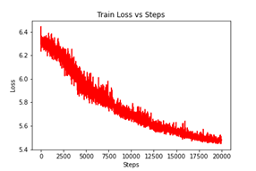

# Aivian
Bird detection model

This model uses datasets from kaggle or nabirds dataset from https://dl.allaboutbirds.org/nabirds.
To get the kaggle dataset, open your kaggle account and do the following:

1. Go to your account, Scroll to API section and Click Expire API Token to remove previous tokens

2. Click on Create New API Token - It will download kaggle.json file on your machine.

Copy the kaggle.json file in your working directory.
After this, open your terminal, shift to your working directory, and follow the following steps:
1. pip install -q kaggle
2. mkdir ~/.kaggle
3. cp kaggle.json ~/.kaggle
4. chmod 600 ~/.kaggle/kaggle.json
5. kaggle datasets download gpiosenka/100-bird-species
6. unzip 100-bird-species.zip

This will download the dataset to your directory. Now when you run main.py you can provide the required directories to train the model and replicate the results.

You can download nabirds dataset from the URL or optionally use Deeplake dataloaders using the options in main.py. The dataset is split into train/valid using the train_test_split.txt file found in the nabirds dataset. You can provide the directories as you wish.

The best performing model on either dataset is the Vision Transformer (ViT) by google from the paper "An Image is Worth 16x16 Words: Transformers for Image Recognition at Scale". We acheived an 89% accuracy on nabirds, just 1.8% less than the baseline architecture TransFG which has an accuracy of 90.8%. 
On the kaggle dataset, we acheived an accuracy of approximately 98%. 
The ViT model uses cosine annealing scheduler and trains for 20000 steps with AdamW optimizer. The time for training is almost 1 hour on a single GPU on the kaggle dataset and 4 hours on nabirds dataset.

It must be noted that to acheive 89% accuracy on nabirds dataset, the images need to be cropped according to the bounding boxes provided in the dataset and resized to a square while making sure that the image aspect ratio stays the same. 

Then to make sure that each class has at least 150 images, the images are augmented using augment.py. 

The accuracies for various models are given below:

The training loss for nabirds dataset is given below:

